# Week 5: Monday, Febuary 24, 2025 
<span style="color:grey">
Review of 21, 2025, week 3, Annette 

* Info from Parvin: we should spend time on career platform every friday 🪄 
</span>

---
## <span style="color:black"> __What we did last Friday__ </span>
 


* <span style="color:grey"> **1. Gradient descent (GD) concept**: find model parameters that minimize cost
* **2. GD algorithm exploration**: play with alpha and iterations for 3 types of GD


---
##  __Schedule__
<span style="color:grey">

|Time|Content
|---|---
|09:00 - 09:40|Review on Regularization (Lasso and Ridge)
|10:00 - 10:40|***Teaching 1***: Concept of GD in LR
|10:45 - 11:00|***Teaching 2***: GD behavior: hyperparameter α (or lr)
|11:00 - 11:40|***Demonstration***: gradient_descent.ipynb 
|11:50 - 12:20|Introduction of days' excercise notebooks
||Lunch break| 
|13:20 - 15:45|***Exercise Notebooks***: 1_Gradient_Descent.ipynb, 2_Gradient_Descent_Visualization.ipynb, 
|15:40 - 16:20|Stand-up Meeting
|16:20 - 17:00|***Exercise Notebooks*** 1-3 in repo ds-gradient-descent

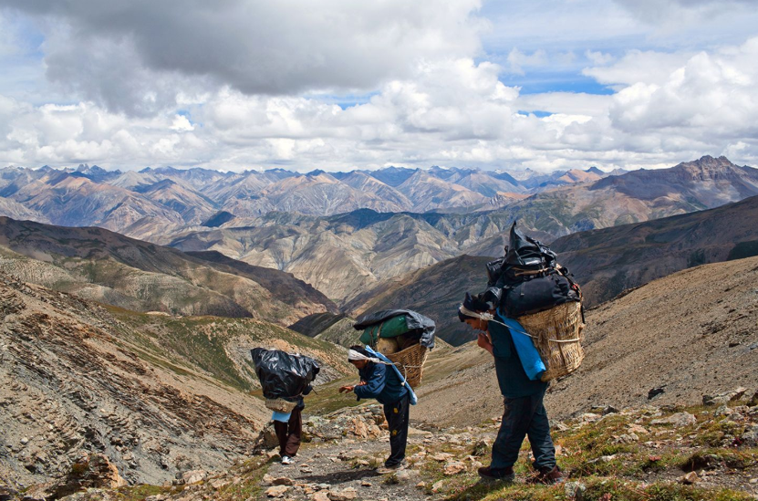

---
## <span style="color:black"> __Whats again a linear regression? Spoiler: 3 types__ </span>
### ***1) Univariate Regression*** 
where y is the ***target*** (= response variable, = dependant variable) and x is the only ***feature*** (= predictor variable = independant variable)
[Excalidraw tool: cute quick drafts](https://excalidraw.com/)

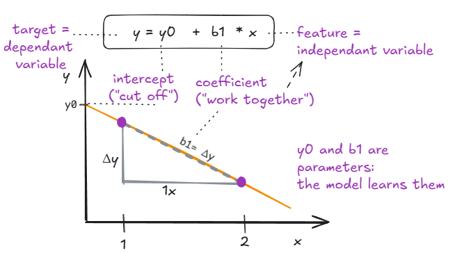

---
### ***2) Multiple Linear Regression*** $$ y = y_0 + \text{coeff}_1 x_1 + \text{coeff}_2 x_2 + ... +  \text{ coeff}_m x_m $$
Many **independant** features (predictor variables), each with their coefficient describe the target/response variable. There should not be strong colinearity among predictor variables. 

Why avoid colonearity?
* Unstable Coefficients
* Inflated Standard Errors
* Reduced Predictive Power
* Difficulty in Interpretation parameter meaning
* Incorrect Statistical Inference/ conclusions

---
### ***3) Multivariate Regression***$$ y_1 = y_{0_1} + \text{coeff}_{1_1} x_1 + \text{coeff}_{2_1} x_2 + \dots + \text{coeff}_{m_1} x_m $$ $$ y_2 = y_{0_2} + \text{coeff}_{1_2} x_1 + \text{coeff}_{2_2} x_2 + \dots + \text{coeff}_{m_2} x_m $$

As we can see, the same set of features/predictor variables is used (with different parameters!) to predict two different targets/ response variables. This is often used in economics, e.g. two targets can be revenue and profit.

---
***Summary:*** 
* Coefficients describe impact of features on target. 
* Intercept describes the state of target, when influence of features is zero.
* Both parameters are determined in modeling to describe and predict traget values.
* If linear models have polynomial and intercation terms they are still linear models, because the parameters themselves have a linear relationship to the target!
* standartization, normalization and ragualization take away a bit of interpretability from equation parameters, but we boost predictive power


---
## <span style="color:black"> __Fitting a regression line to a data set...__ </span>
__... in other words, which parameters minimize the error (e.g MSE)?__ </span>

<span style="color:grey">

👍 We know that ***ordinary least squares (OLS) minimizes squared residuals to determine optimal parameters***. OLS is an analytical solution, that allows for smallest loss - guaranteed. 

👍 Another analytical solution: solving a ***normal equation*** of the feature matrix:
$$
(X^T X) \beta = X^T y \hspace{1cm}\Leftrightarrow\hspace{1cm}\boldsymbol{\beta} = (X^T X)^{-1} X^T y
$$

[Link to math behind analytical solutions to determine the best regression coefficients](https://blog.dailydoseofds.com/p/2-mathematical-proofs-of-ordinary)


----
👎 Disadvantage: complex models cause large inaccuracies in estimated parameters. 

👎 Inversion process itself is computationally expensive, which can exacerbate issues in large datasets. 

👎 Analytical solutions to determine exact parameters seem overkill for complex models, like MLRs with polynomials and interactions


### If only we knew a way to make a good approximation for complex model coefficients that can be efficient + sufficient ...

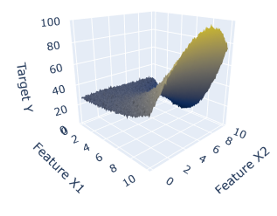

---
----
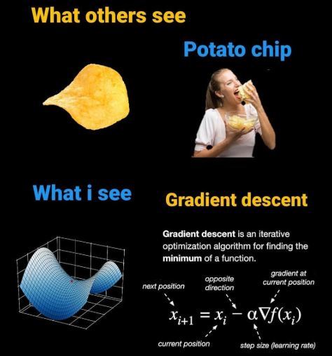

***Good news!*** There is a ***faster numerical solution*** to approximate parameters with an algorithm called ***Gradient Descend (GD)*** that does a stepwise updating of parameters while producing small(est) cost functions!

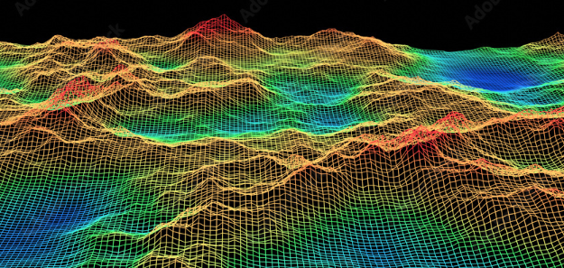
## <span style="color:Orange"> __Advantages of Gradient Descent: robust and versatile!__ </span>
🚀 **Scalable** for large datasets and high-dimensional data.  
🔄 **Flexible** with various loss functions (e.g., linear, logistic regression, neural networks).  
⚡ **No matrix inversion** needed, reducing numerical instability.  
🤖 Effective for **non-linear models**.  
📉 **Convergence control** via learning rate adjustments.  
⏩ **Faster** than analytical methods for large datasets.  
🌀 Supports **stochastic** and **mini-batch** modes for efficient processing.


---
## <span style="color:black"> __GD: learning rate $\alpha$ determines step size__ </span>

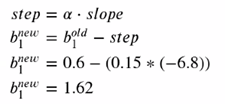

Note: ***$\alpha$ = 0.1*** is a good choise if you have no other information!


---
## <span style="color:black"> __Example in Notebook of one simple cost funcion J(b0, b1): MSE/2__ </span>

<span style="color:grey">

1. start: random parameters b0, b1
2. obtain derivative of cost function J(b0, b1) = slope of cost at these exact parameters 
3. reduce parameters b0, b1 by step size ( step = alpha * slope)
4. Rrepeat 2. - 3.  

a) for n iterations and or

b) set threshold for acceptable J(b0. b1) and process stops when it is reached

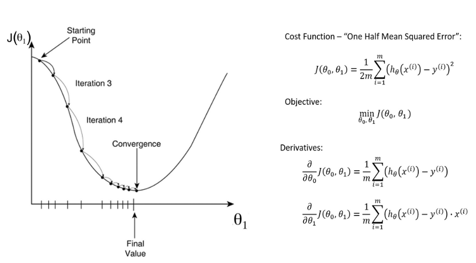

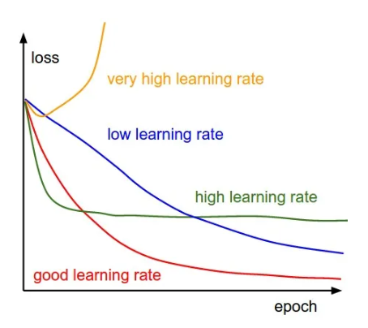
---

## <span style="color:black"> __3 ways to get parameters using GD__ </span> 
1. ***Batch GD***: take full data set
2. ***Stochastic GD***: take single random observation(s)
3. ***Mini batch GD***: take fraction(s) of data set

In each case, cost function of parameters is calculated:
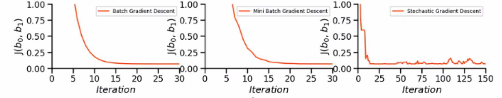


## <span style="color:black"> __Our code in Notebook1: Batch GD for n observations__ </span> 


$$
\large
X = 
\begin{bmatrix}
1 & x_1 \\
1 & x_2 \\
\vdots & \vdots \\
1 & x_n
\end{bmatrix}, \quad
y = 
\begin{bmatrix}
y_1 \\
y_2 \\
\vdots \\
y_n
\end{bmatrix}, \quad
b = 
\begin{bmatrix}
b_0 \\
b_1
\end{bmatrix}
$$

Multiplying X with the parameter vector \(b\) gives us many predicted y:

$$
\large
X⋅b = 
\begin{bmatrix}
1 & x_1 \\
1 & x_2 \\
\vdots & \vdots \\
1 & x_n
\end{bmatrix}
\cdot
\begin{bmatrix}
b_0 \\
b_1
\end{bmatrix}
=
\begin{bmatrix}
b_0 + b_1 \cdot x_1 \\
b_0 + b_1 \cdot x_2 \\
\vdots \\
b_0 + b_1 \cdot x_n
\end{bmatrix}
$$

$$
\huge
\text{Cost} = \frac{1}{2} \sum_{i=1}^{n} (\hat{y_i} - y_i)^2
$$


## <span style="color:black"> __Stochastic GD for n observations__ </span> 

```python

def SDG(X, y, b, learning_rate=0.01, iterations=10):
    '''
    X           = Matrix of input features with added bias units (shape: n x m)
    y           = Vector of target values (shape: n x 1)
    b           = Vector of parameters (b0 & b1, shape: m x 1)
    alpha          = Learning rate (default 0.01)
    it          = iterations (default 10)
    
    Returns:
    b            = Final parameter vector (b0 & b1) after training
    cost_history = Array of cost for each iteration based on random sample
    '''
    n = len(y)
    cost_history = np.zeros(iterations)
    
    # SGD - Update parameters using one random example at a time - which makes small or large jumps
    for it in range(iterations):
        random_index = np.random.randint(0, n)            # Random integer between 0 and n-1
        X_i = X[random_index, :].reshape(1, X.shape[1])   # Extract X at random row rand_ind
        y_i = y[random_index].reshape(1, 1)               # Extract y at random row rand_ind
        predicted_y = np.dot(X_i, b)                      # Model prediction of y using b
        
        # Update parameters using the gradient (aka slope = derivative)
        b = b - alpha * (X_i.T.dot(predicted_y - y_i))    # Stochastic update: error (difference) determines jump size
        
        # Calculate the cost of this random example
        cost = cal_cost(b, X_i, y_i)
        
        # Store cost for this iteration
        cost_history[it] = cost

    return b, cost_history
````

$$
\huge
\hat{y_i} = X \cdot b = \begin{bmatrix} 1 & x_i \end{bmatrix} \cdot \begin{bmatrix} b_0 \\ b_1 \end{bmatrix} = b_0 + b_1 \cdot x_i
$$

----
## <span style="color:black"> __Outlook: other loss functions__ </span>

( Nokebook 3_Gradient_descent_Codealong.ippynb)

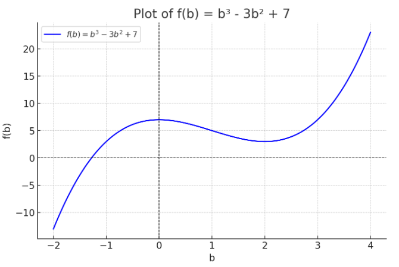


## <span style="color:black"> __Outlook: Momentum__
( Notebook 2_Gradient_Descent_Visualization.ipynb)

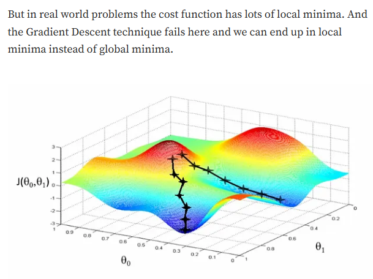

Momentum is a technique used to accelerate the convergence of the algorithm by helping it move more smoothly and consistently in the relevant direction, while reducing oscillations. It builds on the idea of using past gradients to influence the current update.

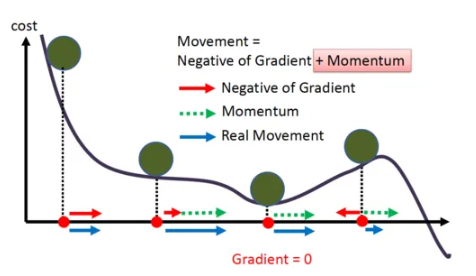

---
## <span style="color:black"> __Helpful References__
* [Article on Medium: Gradient descent](https://medium.com/codex/gradient-descent-cb0f02dc6eab#:~:text=Gradient%20descent%20is%20an%20optimization,and%20weights%20in%20neural%20networks) 
* [An easy guide to gradient descend in machine learning](https://www.mygreatlearning.com/blog/gradient-descent/#:~:text=Gradient%20descent%20subtracts%20the%20step,be%200.1%2C%200.01%20or%200.001)
* [5 Concepts You Should Know About Gradient Descent and Cost Function](https://www.kdnuggets.com/2020/05/5-concepts-gradient-descent-cost-function.html)
* [Gradient Descent with Momentum, RMSprop And Adam Optimizer](https://medium.com/analytics-vidhya/momentum-rmsprop-and-adam-optimizer-5769721b4b19)
