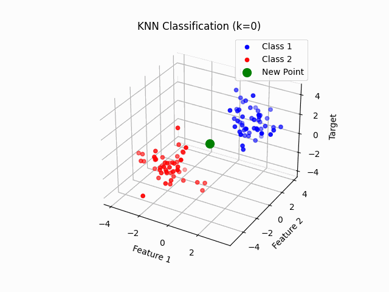
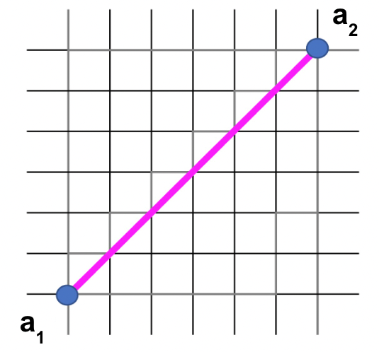
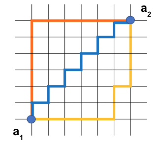
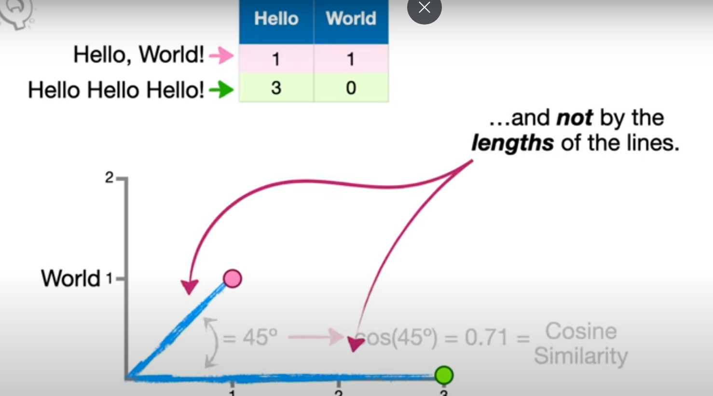
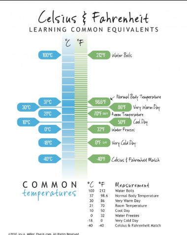

Neue fische School and Pool for Digital Talent 
___
# Data Science Boot Camp

 **26 February 2025 / Online Session** 

### INSTRUCTOR

Parvin Shafiri (Senior Coach DS)

### ATTENDEES

Annete Manntschke, Aylin Hanne, Eva Schmidt, Jesus Gonzalez, Jonas Schors, Katharina Baumgarter, Lida Shamsafar, Maren Bormann, Maria Berger, Parya Tavakoli-Therani, Simon Cornevin, Tim Weiand, Utku Oezkan

## TOPICS : KNN AND DISTANCE METRICS

### **Summary:**

1. Recap on General Concepts: In <strong>supervised learning</strong>, algorithms are trained using labeled datasets, meaning each input comes with a corresponding correct output. **Unsupervised learning** involves algorithms analyzing unlabeled data to identify hidden patterns or intrinsic structures without external guidance.

2. The k-Nearest Neighbors (**k-NN**) algorithm is a **straightforward, non-parametric** supervised learning method used for both **classification** and **regression** tasks. It operates on the principle that data points with similar features are likely to have similar outcomes. In essence, k-NN classifies a new data point based on the majority class among its 'k' closest neighbors in the feature space.

3. **Distance Metrics**: There are different ways of quantifying Distance, we explored: Euclidian, Manhattan, Minkowsi and Cosine Similarity.Selecting the appropriate distance metric is crucial for the performance of algorithms.

---

<div align="center">

|  ||  |
| :-----: | :-----: | :-----: |
| `Supervised Learning` | `KNN Algorithm` | `Distance Metrics` |

</div>   

# NOTES

## **Supervised vs. Unsupervised Learning**
<div align="center">

| Supervised | Unsupervised | 
| :---------------: | :---------------: | 
| Requires labeled Data   | Works with unlabeled Data   | 
| Predicts outcomes for new Data based on learned patterns |Aims to uncover hidden patterns|
| Used where historical data with known outcomes is available|Seeks to understand the underlying relationships within the data, making it useful for exploratory analysis|
| Linear regression, support vector machines, and neural networks | K-means clustering, hierarchical clustering, and principal component analysis   |
| Classifying E-mails as Spam or not, Image recognition (Cat or Dog), Forecasting future sales|Customer Segmentation (purchasing behaviour), Anomaly Detection (unusual data points, fraud detection), Dimensionality Reduction (reduce the number of variables in data to make visualization easier )| 

</div>


<style>
  table {
    border-collapse: collapse;
    width: 100%;
  }
  th, td {
    border: 1px solid black;
    padding: 8px;
    text-align: left;
  }
</style>


# KNN (Notebooks 3 and 4)


### Paradigm
- Birds of a feather flock together.
- Sampe principle as Kitchen Table vs Fridge.
- Or Computer Memory Cache.
- It is still a Supervised algorithm.

### Why KNN
- Despite being simple:
   - Good for Classification (handwriting of numeric characters, or satellite imagery).
   - It solves also regression problems.

### Characteristics
 - Non parametric : It doesn't assume a specific form of the data. Reads fresh entire dataset.
 - Input (Features, Target, Hyperparameters)
   - Nr of Neighbors, K
   - Distance Metric (more later)
   - Weight
 - Loops through all observations.
 - Calculates the distance to everyone.
 - Sort and Pick the closest neighboors.
 - Pick a k that does not over or under-fit.

### How to measure proximity? 
 - Categorical features can be a problem.
 - Which Distance? (To be detailed below)
    - Euclidian
    - Manhatann
    - Minkowski
    - Cosine 

||||
| :-----: | :-----: | :-----: |

# DISTANCE METRICS (Notebooks 1 and 2)

|||||
| :-----: | :-----: | :-----: | :-----: |

Not all the distances are the same

- Evolution? 
  - Minkowski:
    - The Minkowski distance is a generalization of the Euclidean distance and can be used to calculate the distance between two points in an n-dimensional space.
    - $\ Minkowski\: Distance = \sqrt[p]{\sum_{i=1}^n |a_1,_i - a_2,_i|^p}$ that means:
$\ Minkowski\: Distance = \sqrt[p]{\sum_{i=1}^n side\:length^p}$
  - Euclidian:
    - The Euclidean distance is defined as the beeline distance between two points. It is calculated from the cartesian coordinates of the points using the pythagorean theorem.
    - $\ Euclidean\ Distance = \sqrt{\sum_{i=1}^n |a_1,_i - a_2,_i|^2}$ that means:
$\ Euclidean\ Distance = \sqrt{\sum_{i=1}^n side\:length^2}$
  - Manhattan:
    - The Manhattan distance is the sum of absolute differences between the points' coordinates. It is measured along axes at right angles. How the path is taken does not matter, all routes lead to the same distance value.
    - $\ Manhattan\:
    Distance = \sum_{i=1}^n |a_1,_i - a_2,_i|$
that means:  $\ Manhattan\ Distance = \sum_{i=1}^n side\: length$
  - But then Cosine
    - Cosine distance measures the dissimilarity between two vectors by calculating the cosine of the angle between them. It is defined as one minus the cosine similarity:
    - $\ Cosine\ Distance = 1 - \frac{ \mathbf{A} \cdot \mathbf{B} }{ \| \mathbf{A} \| \| \mathbf{B} \| } $
    - The cosine similarity ranges from -1 to 1, 1 indicates that the vectors are in identical direction, 0 that they are orthogonal (no similarity), -1 means they are diametrically opposite.
    - Used in text analysis and information retrieval to measure similarity between documents and or sentences. 

  - Would the following be all right?
  - ``` 
    def distance(x, y, p=2, verbose=True):
      #Calculate the distance between two vectors x and y.

      #Parameters:
      #- x: First vector (tuple or array).
      #- y: Second vector (tuple or array).
      #- p: The order of the norm (default is 2, which corresponds to Euclidean distance).
      #- verbose: If True, prints the type of distance metric used.

      #Returns:
      #- The Minkowski distance between x and y.
    
      # Convert inputs to numpy arrays for element-wise operations
      x = np.array(x)
      y = np.array(y)

      # Ensure the vectors have the same length
      if x.shape != y.shape:
        raise ValueError("Vectors x and y must have the same length.")

      # Compute the Minkowski distance
      dist = np.sum(np.abs(x - y) ** p) ** (1 / p)

      # Verbose output
      if verbose:
          if p == 1:
              print("Using Manhattan distance.")
          elif p == 2:
              print("Using Euclidean distance.")
          else:
              print(f"Using Minkowski distance with p = {p}.")

      return dist

- Do not forget Scaling or not (David vs Goliath)



# EXTERNAL LINKS AND FURTHER INFO

 - [Cosine Distance](https://www.youtube.com/watch?v=e9U0QAFbfLI)
 - [Distance Metrics in Machine Learning](https://www.youtube.com/watch?v=QjcSLm_2bMw&t=14s)
 - [How to Implement KNN from scratch](https://www.youtube.com/watch?v=rTEtEy5o3X0)
