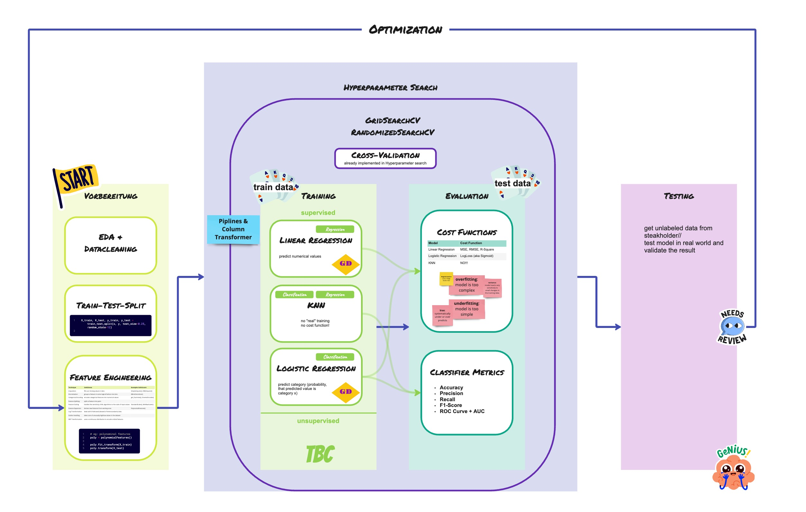
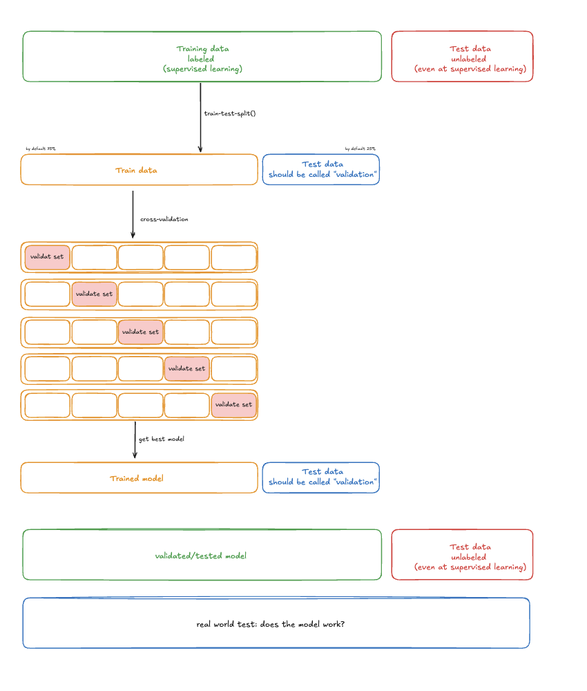

# Week 5 Thursday, 27.02.2025
<span style="color:grey">
Review of Thursday 27.02.2025, week 5, Katharina
</span>

---
## <span style="color:black"> __Basic Overview__ </span>
 

* [Feature Scaling](#scaling) with StandardScaler(), MinMaxScaler() and RobustScaler()
* [Cross Validation](#cross-validation)
* [Hyperparameter Tuning](#hyperparameter-search) with GridSearchCV() and RandomizerSearchCV()

---
##  __Schedule__


|Time|Content|
|---|---|
|09:00 - 10:00|Review|
|10:00 - 12:00|Notebook 1: Scaling & Hyperparameter Tuning|
|12:00 - 13:00|Lunch Break| 
|13:00 - 16:00|Group Work: Notebook 2: Heart Attack|
|16:00 - 17:00|Standup|


---
## <span style="color:black"> RECAP Overview </span>




**➡️ Have a look at [miro](https://miro.com/app/board/uXjVIaeC54k=/?share_link_id=390078315376)**

_____

## <span style="color:black"> Scaling </span>
<span style="color:grey"> have also a look to the notebooks of `Feature Engineering` in the Topup folder!</span>

- feature scaling is part of feature engineering!
- it's a crucial step that involves transforming the features (independent variables) to a similar scale in order to prevent the algorithm from being biased towards the features with a larger scale

### MinMaxScaler() - Normalization

**Advantages:**
1. Easy to implement and understand.
2. Preserves the original distribution of the data.
3. Can be useful when data needs to be transformed to a specific range (e.g., 0 to 1).
4. Works well when the data doesn't have extreme outliers.

**Disadvantages:**
1. Susceptible to extreme outliers, which can skew the scaling.
2. Not suitable for algorithms that assume a Gaussian (normal) distribution of data.

**Usage:**
Choose this method when the data has a **non-Gaussian distribution**, and there's a requirement to **scale the features within a specific range** (e.g., 0 to 1). This is particularly useful in cases of image processing, deep learning, or when working with algorithms sensitive to the input range, such as K-Nearest Neighbors and neural networks.

### StandardScaler() 
**Advantages:**
1. Less sensitive to outliers compared to Min-Max Scaling.
2. Centers the data around the mean, making the data suitable for algorithms that assume a Gaussian distribution (e.g., linear regression, logistic regression, and support vector machines).
3. Enhances the performance of gradient-based algorithms by standardizing the feature scales.

**Disadvantages:**
1. May not be suitable for certain types of data, such as when the original distribution is not Gaussian.
2. Does not provide a bounded range, unlike Min-Max Scaling.

**Usage:** Choose this method when the data has a **Gaussian distribution**, or when working with algorithms that assume a Gaussian distribution, such as linear regression, logistic regression, support vector machines, and principal component analysis. Standardization can also be beneficial for gradient-based algorithms by ensuring faster convergence.

### RobustScaler()

scales data using the median and interquartile range (IQR) instead of the mean and standard deviation 

**Advantages:**
1. Handles outliers well
2. Works for non-Gaussian data
3. Retains relative data spread 

**Disadvantages:**
1. Does not standardize to a fixed range, results may have varying ranges.
2. Less effective for normal data 
3. Computationally expensive – Computing medians and IQRs can be slower than computing means and standard deviations, especially for large datasets.

_____

## <span style="color:black"> Cross Validation </span>

- **aim**: want to find best hyperparameters for our model
- to do so (hyperparameter search!), we have to test different parameters
- **BUT**: we cannot use our test data set (it's holy, we can only use once!) 
- **solution**: split our training set in different folds, and test with them!

_don't worry: cross validation is already implemented in hyperparameter tuning! Just select the folds (cv)_



_____

## <span style="color:black"> Hyperparameter Search </span>

- **aim**: we're still in training our model and want to find the best model > so we're looking for the best hyperparameters! _Which one should we use?_
- `GridSearchCV`and `RandomizedSearchCV`help us to find the best hyperparameters in our models
- in each version we need to define the hyperparameters, we want to test

```python
# Defining parameter grid (as dictionary)

param_grid = {"n_neighbors" : [2,4,3,5,10], 
              "weights" : ["uniform", "distance"],
              "p" : [1, 2, 3],
              "algorithm": ["ball_tree", "kd_tree", "brute"]
             }
```

### GridSearchCV
- tuning technique that attempts to compute the optimum values of hyperparameters
- search over a prior defined parameter space using cross-validation
- **very time-consuming!!**

```python
# cv: defines our cross validation folds
# scoring: evaluation metric (cost-function!)
# n_jobs: CPU
gs = GridSearchCV(KNeighborsClassifier(), param_grid, scoring='accuracy',
                  cv=5, verbose=3, n_jobs=-1)

gs.fit(X_train, y_train)  
```

### RandomizedSearchCV
- randomly pick and evaluate parameter combinations

```python
# n_iter: set a limit to parameter fitting
# cv: defines our cross validation folds
# scoring: evaluation metric (cost-function!)
# n_jobs: CPU
rs = RandomizedSearchCV(KNeighborsClassifier(), param_grid, scoring='accuracy',
                  cv=5, verbose=5, n_jobs=-1, n_iter=10, random_state=RSEED)

rs.fit(X_train_preprocessed, y_train)
```

### Outcome:
We will get the best score, params and model with

```python
best_score = rs.gs.best_score_

best_params = rs.gs.best_params_

best_model = rs.best_estimator_
```

We can then predict the test-data with our best model!