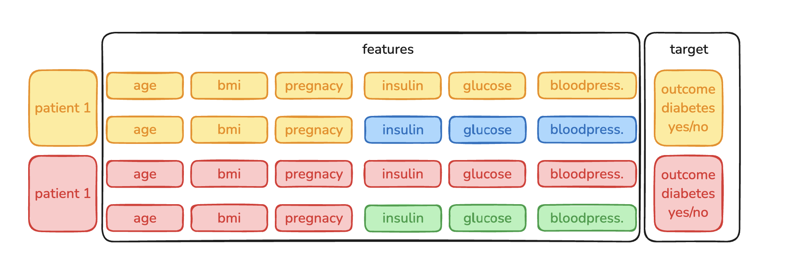

---
## __Basic Overview__ 
 

*  We worked on the diabetes dataset to predict diabetes
*  We trained two different machine learning models
*  We tried to optimize the hyperparameters
*  We found out they were cheating for the solution

---
##  __Schedule__

|Time|Content|
|---|---|
|09:00 - 10:00|Review|
|10:00 - 11:20|Lesson by Parvin on Notebook 1|
|12:00 - 12:30|Working on Notebooks|
|12:30 - 13:30|Lunch Break| 
|13:30 - 16:00|Working on Notebooks|
|16:00 - 17:00|Standup|
|17:00 - open-end|Working on Notebooks|

---
## __Yesterdays Task__

What were your most important takeaways?

- Balanced sets are very important
- You can build your own transformer and come up with a scoring mechanism
- Pipelines make the workflow more structured

## __Data Leakage__

## __Class Imbalance__

Class imbalance happens when one class has way more examples than another, like when there are way more non-diabetic cases than diabetic ones. This can mess up the model because it learns to mostly predict the majority class and ignores the minority class. As a result, you might get high accuracy, but the model is actually bad at detecting the minority cases.

--> __Class Imbalance notebook__

There are a few ways to deal with class imbalance:

- Oversampling the Minority Class - This means adding more copies of the minority class or generating fake examples. A common way to do this is SMOTE, which creates synthetic samples based on existing data.

- Undersampling the Majority Class - Here, you remove some majority class samples to even things out, but this can be risky because you might lose important information.

- Class Weighting - Some models let you increase the importance of the minority class so that errors in predicting it matter more, forcing the model to pay attention to it.

- Synthetic Data Generation - More advanced methods like GANs can create new data points that look realistic and help balance the dataset.

- Anomaly Detection Approaches - If the minority class is really rare, it might make more sense to treat the problem like anomaly detection instead of a normal classification problem.

Which method works best depends on the dataset, the model you're using, and how imbalanced the data is. Often, a mix of these approaches is needed to get good results.
