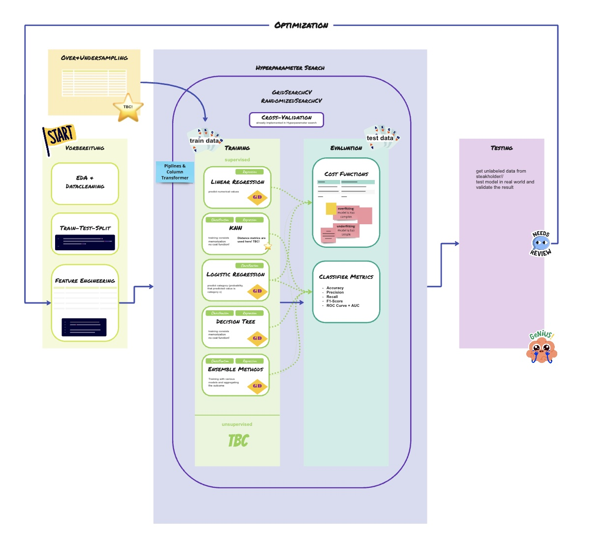
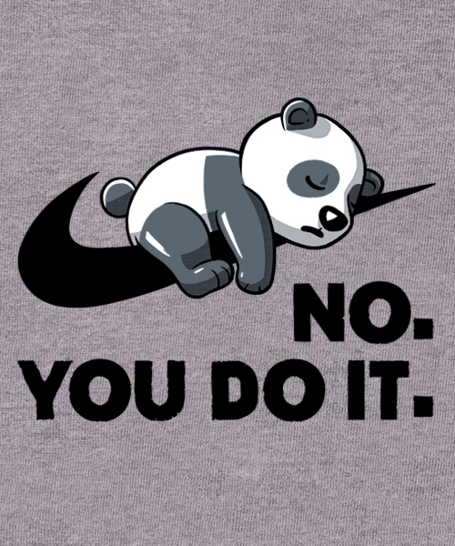

# Week 6, Wednesday, 05.03.2025

Review of the first session of Ensemble Methods on Tuesday, 04.05.2025, prepared by [Parya.](https://www.linkedin.com/in/parya-tavakoli-tehrani/)

### We are half way through?! Already?

---
##  __Basic Overview__ 
 

* [Where we are now](#where-we-are-an-overview)
* [Ensemble Methods: What, why, and how](#ensemble-methods-what-why-and-how)
    * [Majority Voting](#1-majority-voting)
    * [Blending](#2-blending)
    * [Stacking](#3-stacking)
    * [Bagging](#4-bagging)
        * Random Forest being a sub-category

---
##  __Schedule__

Do we really care? 

---
##  __Where we are: an Overview__ 

There are new pieces of puzzel added to our board (courtesy to Katharina) (which will be fine-tuned as we move along):

**➡️ Have a look at [miro](https://miro.com/app/board/uXjVIaeC54k=/?share_link_id=390078315376)!

---
---
#  Ensemble Methods: What, why, and how 

* What is **CART**? Classification And Regression Tree

    * One big issue is the high variance and overfitting
    * It is also highly sensitive and as a result, unstable. 

To deal with this, we reach out to the Wisdom of Crowds and use an **ensemble** of models. 

To interpret these models, yesterday we looked at four **methods**:

---
---
##  1. Majority Voting
**One way of using Wisdom of Crowds**

So what do we do when we have multiple models, predicting different things? 

The first choice that comes to mind is to vote. Very democratic: 

* ### Hard voting 
    * The same way elections work

* ### Soft voting 
    * Instead of a Yes/No (or Zero/One), the output is a probability of one output (i.e., Yes or One)
    * The final vote is the average of all the votes

Source of the images: [It's in Korean!](https://devkor.tistory.com/entry/Soft-Voting-%EA%B3%BC-Hard-Voting)

* ## Calibration: Just Do It!  

Or if you are working in teams: 

 

---

**A few points:**

1. Calibration ensures that predicted probabilities reflect real-world likelihoods.

2. Poorly calibrated models are either overconfident or underconfident.

3. Calibration methods adjust probabilities to improve reliability.
Common techniques: 
    * Platt Scaling (logistic regression) 
    * Isotonic Regression (non-linear)

---
---
##  2. Blending 

 

**Step 1:** Split the data into train and test
 
**Step 2:** Split the training data into Holdout and Training 

**Step 3:** Use your different models on the Training set 

**Step 4:** Carry out cross validation on the same set for each model 

**Step 5:** Predict values using the data in your Holdout -> Your prediction are your new features

**Step 6:** Extract the true target values from the Holdout set

**Step 7:** Train a meta-model using the Holdout predictions as inputs and perform cross validation

**Step 8:** Use the trained base models to predict on the test set and feed these predictions into the meta-model

---
---
##  3. Stacking 

**Step 1:**  Split the dataset into training and test sets

**Step 2:** Train and cross validate the first model on the training set

**Step 3:** Make prediction on each validation set

**Step 4:** Repeat steps 2 and 3 for each model

**Step 5:** Use the created predictions as features for the meta-model

**Step 6:** Train the meta-model on the whole training set (using the new features)

**Step 7:** Make predictions on the test set using base models and pass them to the meta-model (The final prediction is made by the meta-model)

---
---
##  4. Bagging 

**B**ootstrap **agg**regat**ing** 

✅ **Ensemble Learning with One Model Type:**

 Bagging **only** combines multiple instances of <ins>the same model type</ins>. Unlike boosting or stacking, it does not mix different models.

✅ **Bootstrap Sampling:**

 Each model in the ensemble is trained on <ins>a different subset</ins> of the training data, created using <ins>random sampling</ins> with <ins>replacement</ins>. This ensures the next point:

✅ **Independent Models:** 

Each model in the ensemble is trained separately and makes predictions independently.

✅ **Averaging for Stability:**

 * For regression, predictions are averaged 
 * For classification, a majority vote is taken
 * As a result, the final output is more stable and less sensitive to noise.

Since bagging reduces variance, it is particularly useful for high-variance models like decision trees, preventing them from memorizing the training data, sooooo:
* If the models used for Bagging are Decision Trees, we call it a <ins>**Random Forest**</ins> model. 

---

##  __Extra Resources__ 

* This [YouTube link](https://www.youtube.com/watch?v=sN5ZcJLDMaE) explains all the methods, including boosting
* This [other YT Link](https://www.youtube.com/watch?v=lcXKFS65BI0) is more comprehensive
* And here is the [Statquest channel](https://www.youtube.com/@statquest) that Lina mentioned

