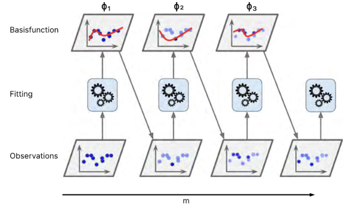
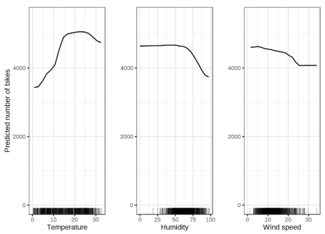
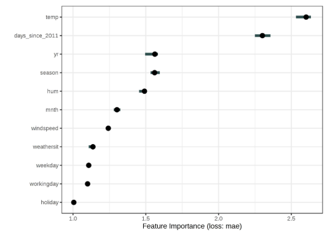
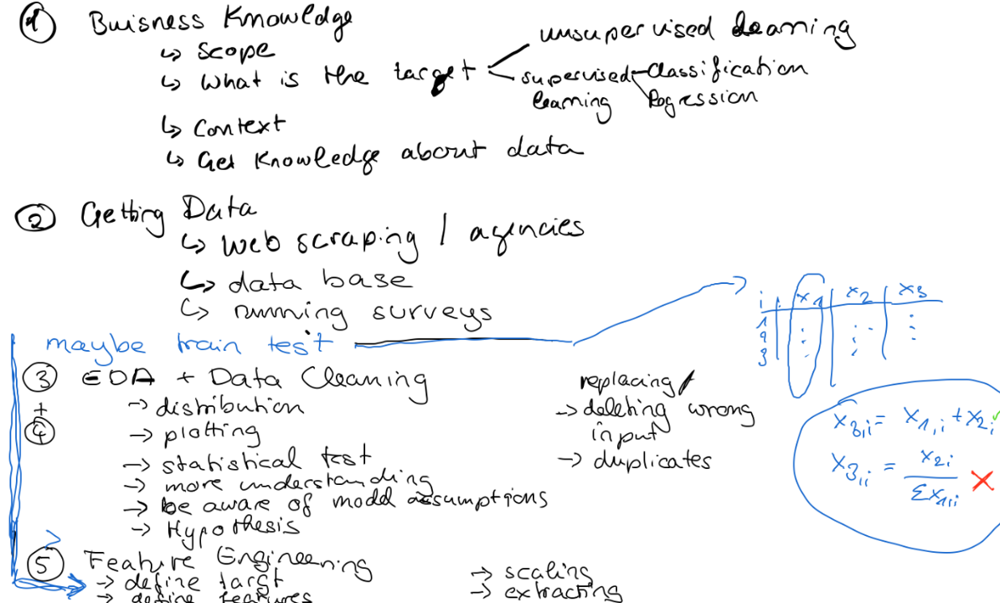
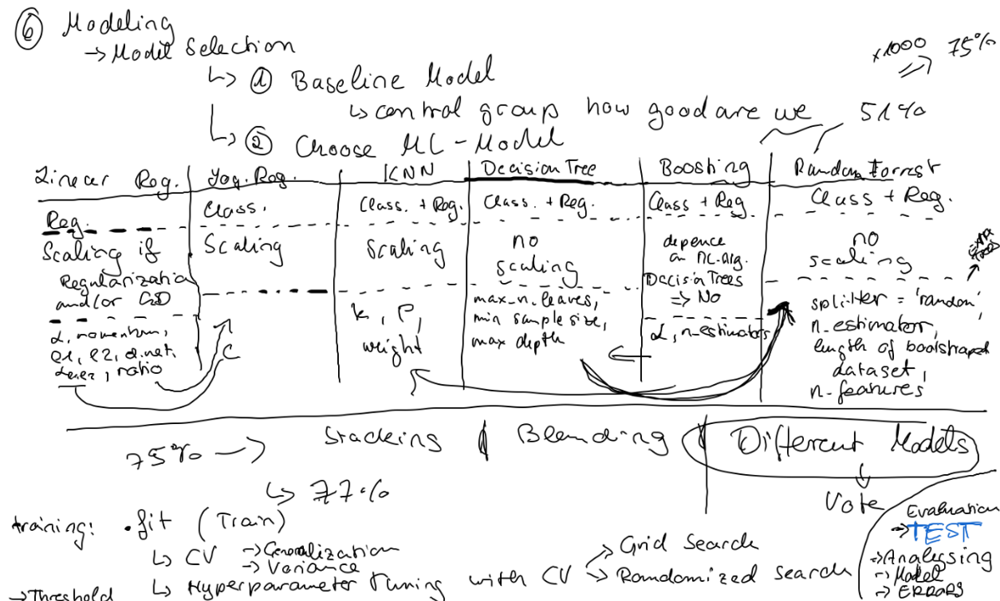

# Week 6, Thursday, 06.03.2025

Review of the second session of Ensemble Methods on Wednesday, 05.03.2025, prepared by [Maria.](http://www.linkedin.com/in/maria-berger-1a061193)

---
##  __Basic Overview__ 
 

* Ensemble Methods Part 1 (see review of 05.03.2025):
    1. Majority Voting (part of a model or Ensemble Method)
    2. Blending
    3. Stacking
    4. Bagging
        * Random Forest

<!-- TOC -->
* [Ensemble Methods Part 2](#ensemble-methods-part-2)
    * [Boosting](#boosting)
        * [Comparing Boosting Methods](#comparing-boosting-methods)
        * [AdaBoost](#adaboost)
        * [LogitBoost](#logitboost)
        * [Gradient Boost](#gradient-boost)
        * [XGBoost (eXtreme Gradient Boost)](#xgboost-extreme-gradient-boost)
        * [Stochastic Gradient Boost](#stochastic-gradient-boost)
        * [Cat Boost](#cat-boost)
        * L2Boosting (optimization: squared error)
    * [Interpreting black box models](#interpreting-black-box-models)
        * [Partial dependence plots](#partial-dependence-plots)
        * [Permutation feature importance](#permutation-feature-importance)
* [Excursus Data Science Lifecycle: The big picture](#excursus-data-science-lifecycle:-the-big-picture)
<!-- /TOC -->

---
#  Ensemble Methods Part 2 

##  Boosting

* multiple models are trained sequentially in a row
* in each step the weights of the misclassified points are increased to improve the model's performance in the next sequence

* we prevent under- and overfitting by finding the optimal number of sequences, called **early stopping** 

### Comparing Boosting Methods

### AdaBoost

* Adaptive Boosting
* most commonly using decision trees with one node ('forest of stumps')
* high weight on misclassified target values
* uses the exponential loss function for optimization

### LogitBoost

* possible to extract probabilities (therefore good for probabilistic classification)
* uses the logloss function for optimization

### Gradient Boost

* sequentially adding predictors
* uses the absolute error for optimization (gradient-based)

### Stochastic Gradient Boost

* uses a random subset (faster training)
* higher bias, lower variance

### XGBoost (eXtreme Gradient Boost)

* automatic early stopping
* scalable & highly flexible

### Cat Boost

* for datasets with categorical features as it uses **target encoding**

---

#  Interpreting black box models 

##  Partial dependence plots

We force all data points to assume a fixed value for one of the features and plot it for all data points of the feature.

✅ intuitive interpretation  
✅ causal interpretation for the model  
❌ maximum 2 features per plot  
❌ assumption of feature independence  

##  Permutation feature importance

Permutation feature importance measures performance drop when a feature's values are randomly shuffled.

✅ interpretation as the loss if the feature is removed  
✅ interaction with other features is taken into account without retraining  
❌ unclear if test or train data should be used  
❌ doesn't deal well with correlated features  

---
#  Excursus Data Science Lifecycle: The big picture 

##  __Extra Resources__ 

* There are a lot of videos regarding boosting and the specific boosting algorithms on the [Statquest channel](https://www.youtube.com/@statquest).

