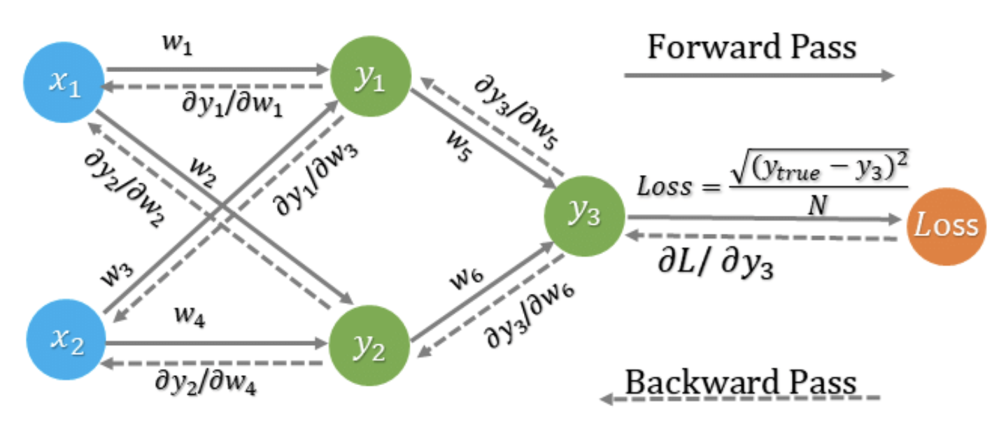

# 12.03.2025

##  __Basic Overview__

* Intro to Neural Networks
* Key components of Neural Networks
* Backpropagation
* Libraries and useful hyperparameters

---
##  __Schedule__

|Time|Content|
|---|---|
|09:50 - 10:00|Review|
|10:00 - 12:30|Lecture Artificial Neural Networks|
|12:30 - 13:30|Lunch Break|
|13:30 - 14:30|More Theory on Neural Networks| 
|14:30 - open-end|Working on Notebooks|

---

# Artificial Neural Networks

## **Inspiration from the brain:**

Neural networks are inspired by the human brain's structure and function.

## **When and why?**:

- Non-linearity:
    - for nonlinear features, you would need to apply a lot of polynomials
    - would lead to massive amount of features, which is computational expensive
- Many dimensions:
    - even small images can have millions of features

## **Exclusive or (XOR) Problem & Neural Networks:**

- The XOR function takes two binary inputs and outputs true (1) only when the inputs are different:

    - `0 ⊕ 0 = 0`
    - `0 ⊕ 1 = 1`
    - `1 ⊕ 0 = 1`
    - `1 ⊕ 1 = 0`

- A single-layer perceptron can only solve **linearly separable** problems, meaning that you can separate classes with a straight line. 
- Introduction of hidden layers solved the problem:
    - First layer captures basic patterns (e.g., OR, AND)
    - Second layer combines results to solve XOR

## **Key Components of Neural Networks:**

- **Layers:** Neural networks include an **input layer**, one or more **hidden layers** and an **output layer**. 
- **Neurons:** Basic units of neural networks, receiving inputs, processing them, and sending outputs to other neurons.
- **Weights and Biases:** Adjustable parameters that determine the strength of input signals and are updated during training.

## **How Neural Networks Work:**

1. **Data input**: Data is fed into input layer.
2. **Processing**: Information flows through the hidden layers, where complex transformations occur.
3. **Output**: The final prediction or decision is made by the output layer.

## **Processing inside of single neuron**:

An activation function is a function that is applied to the output of neural network neuron to determine its final output.

**There are different kinds of activation functions:**
- **Binary Step Function:**
    - Simplest activation function with binary output (0 or 1)
    - Usually not used in hidden layers
- **Sigmoid Function:**
    - Maps input value between 0 and 1, commonly used for binary classification
- **Tanh (Hyperbolic Tangent):**
    - Similar to sigmoid but outputs values between -1 and 1
- **ReLU (Rectified Linear Unit):** 
    - Sets negative inputs to 0 and keeps positive inputs unchanged, widely used in hidden layers
- **GELU (Gaussian Error Linear Unit):**
    - Maps inputs to value between negative and the input, with a smoother transition than ReLU, allowing small negative outputs for negative inputs
- **Softmax:** 
    - Used for multi-class classification, transforming inputs into a probability distribution

## **Training of Neural Networks: Backpropagation**

Backpropagation is similar to **gradient descent**. Both methods are used to optimize performance of a model by minimizing errors. Steps of backpropagation:
1. **Forward Pass:** Network makes a guess by passing inputh through layers 
2. **Error Calculation:** Network calculates how wrong guess was by comparing output to correct value (Loss function)
3. **Backward Pass (Backpropagation):** Network goes backward through its layers to adjust the weights between neurons. Uses derivates to determine direction of adjustments.
4. **Weight Adjustment:** It takes adjustments to minimize error of output (New weight = old weight - (learning rate x error derivate))

## **Libraries and useful hyperparameters**

We focus on TensorFlow and use Keras.

Steps for making a neural network model:
1. Define the model:
    - define shape of input layer 
    - define hidden layers
    - define units of hidden layers
    - choose activation function of layer
2. Compilation:
    - choose optimizer (Adam is commonly used) and define learning rate
    - define loss function (for binary problems BinaryCrossentropy, which is similar to log_loss)
    - define metrics (e.g. recall, precision, accuracy)
3. Fit the model on training data:
    - define number of epochs
    - define batch size for updating weight
    - validation split
4. Evaluate the model

**Most important hyperparameters:**
- Learning rate
- Number of neurons per layer
- Number of features
- Mini-batch size
- Optimization algorithm

**Try random values, do not use a grid!**

