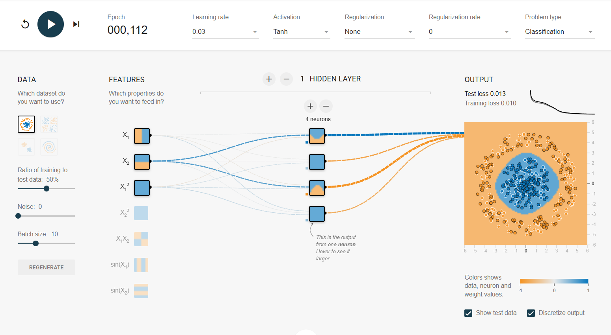

# Artificial Neural Networks 2

#### Review of Thursday, Week 7, 13.03.2025, Annette

---
##  __Summary__ 
 

*  Playing with ANN configurations
*  ANN vocabulary and functionalities
*  Coding ANN with Keras

---
##  __Schedule__

|Time|Content|
|---|---|
|09:00 - 09:30|Daily Review|
|10:00 - 10:30|[Neural Network Playground](https://playground.tensorflow.org/#activation=tanh&batchSize=10&dataset=circle&regDataset=reg-plane&learningRate=0.03&regularizationRate=0&noise=0&networkShape=&seed=0.33333&showTestData=false&discretize=false&percTrainData=50&x=true&y=true&xTimesY=false&xSquared=false&ySquared=false&cosX=false&sinX=false&cosY=false&sinY=false&collectStats=false&problem=classification&initZero=false&hideText=false)|
|10:30 - 11:30|Assignment: ANN vocabulary |
|              |Lunch Break| 
|13:45 - 16:00|03_Overfit_Underfit.ipynb,   04_Load_saved_Models.ipynb  |
|16:00 - 16:40|Stand-up|
|13:45 - 16:00|03_Overfit_Underfit.ipynb,  04_Load_saved_Models.ipynb  |

---
##  __[Neural Network Playground](https://playground.tensorflow.org/#activation=tanh&batchSize=10&dataset=circle&regDataset=reg-plane&learningRate=0.03&regularizationRate=0&noise=0&networkShape=&seed=0.33333&showTestData=false&discretize=false&percTrainData=50&x=true&y=true&xTimesY=false&xSquared=false&ySquared=false&cosX=false&sinX=false&cosY=false&sinY=false&collectStats=false&problem=classification&initZero=false&hideText=false)__ 

 

##  __Assignment: Items and functionalities of ANN:__  
1. ***Architecture***: 
    - Layers and neurons: types and number
    - Epoch (and batch)
    - Loss functions, e.g. mse, log-loss, cross entropy loss
2. ***Activation functions***: When do we use them and where in the network? advantages + disadvantages of 
    - Linear
    - Relu + family
    - TanH
    - Sigmoid
    - Softmax
3. ***Optimizers***: What are the differences? How do we choose one?
    - Gradient descent
    - Adam
    - Momentum
    - RMSPRop) 
4. ***Regularization***: How can we stop our network from overfitting?
    - Drop out
    - Early stopping
    - Batch normalisation, 
    - How does L1/L2 work in ANN?  

---

##  __1. Architecture__ 

## Neurons and layers

You can even combine deep and wide networks!

(Bastani, Kaveh & Asgari, Elham & Namavari, Hamed. (2018). Wide and Deep Learning for Peer-to-Peer Lending. 10.48550/arXiv.1810.03466. )

##  Epoch

    
    

--

## Loss functions

[Source](https://x.com/DynamicWebPaige/status/1012440443823349760/photo/1)

##  __2. Activation functions__ 

***Most commonly used in hidden Layers***:

1. Rectified Linear Activation (***ReLU***)
2. Logistic (***Sigmoid***)
3. Hyperbolic Tangent (***Tanh***)

[Source](https://www.linkedin.com/pulse/activation-functions-neural-networks-leonardo-calderon-j-/)

***Output Layers activation function depends on problem***:

[Source](https://machinemindscape.com/how-to-choose-the-best-activation-functions-for-hidden-layers-and-output-layers-in-deep-learning/)

---
##  __3. Optimizers__ 
Optimizers are algorithms that ***adjust a model's weights to minimize the loss***  function during training. They guide how weights are updated in response to the calculated gradients from backpropagation. 

## Classic Optimization Algorithms

- **1847 - Gradient Descent**: Introduced by Augustin-Louis Cauchy.  
- **1986 - Momentum (SGD)**: Developed by David E. Rumelhart, Geoffrey E. Hinton, and Ronald J. Williams.  
- **2012 - RMSProp**: Proposed by Geoffrey Hinton in his lecture notes.  
- **2014 - Adam (Adaptive Moment Estimation)**: Introduced by Diederik P. Kingma and Jimmy Ba.  

## Nature inspired Optimizer Algorithms

    
    

***2008*** ***Firefly Algorithm (FA)***:  
   - Fireflies communicating using light intensity  
   - **Original Purpose**: Solve complex optimization problems.  
   - **Now Used For**: Image processing, feature selection, and clustering.  

***2009*** ***Cuckoo Search (CS)***:  
   - Cuckoo birds laying eggs in other birds' nests  
   - **Original Purpose**: Find optimal solutions using a mix of random exploration and targeted search.  
   - **Now Used For**: Engineering design, scheduling, and machine learning hyperparameter tuning.    

***2016*** ***Whale Optimization Algorithm (WOA)***:  
   - Bubble-net hunting strategy of humpback whales  
   - **Original Purpose**: Solve continuous optimization problems.  
   - **Now Used For**: Deep learning optimization, feature selection, and medical image processing.  

---

##  __4. Regularization__  
We can add a ***penalty term to the loss function*** during training.

We can ***add noise to the inputs, outputs, or gradients of the network*** to prevent a neural network from overfitting on the training data

## Dropout
During each training iteration, ***dropout randomly deactivates a subset of neurons*** in a layer. The probability of a neuron being dropped is determined by a ***hyperparameter called the dropout rate***

For example, a dropout rate of 0.5 means that each neuron has a 50% chance of being deactivated. The remaining active neurons are scaled up by a factor of $(1 - \text{dropout rate})^1$ to maintain the overall output magnitude

[Source](https://www.geeksforgeeks.org/training-neural-networks-with-dropout-for-effective-regularization/)

## Early stopping
Stopping the training when the training error is no longer decreasing but ***the validation error is starting to rise***.

## Batch Normalization

- If we are able to somehow ***normalize the activations from each previous layer*** then the gradient descent will converge better during training. 
- It is another network layer that gets inserted between a hidden layer and the next hidden layer
- Like the parameters (eg. weights, bias) of any network layer, a Batch Norm layer also has parameters of its own:
    - Two learnable parameters called ***beta and gamma***.
    - Two non-learnable parameters (Mean Moving Average and Variance Moving Average) are saved as part of the ‘state’ of the Batch Norm layer.

Normalized values for each activation feature vector using the corresponding mean and variance: mean=0 and variance=1. 

- **Faster Convergence & Training**: Batch Norm speeds up training and makes models less sensitive to weight initialization and hyperparameter tuning.
- **Higher Learning Rates**: Allows the use of higher learning rates by reducing the effect of outlier gradients, which would otherwise hinder gradient descent.
- **Reduced Gradient Sensitivity**: Dampens the effect of random weight initialization, preventing slow convergence due to outlier gradients.
- **When Not Applicable**:
  - **Small Batch Sizes**: Batch Norm struggles with high noise in mean and variance from small batches.
  - **Recurrent Networks**: In recurrent networks, varying activations make Batch Norm impractical.

[Source](https://towardsdatascience.com/batch-norm-explained-visually-how-it-works-and-why-neural-networks-need-it-b18919692739/)

([Ioffe & Szegedy, 2015, "Batch normalization: Accelerating deep network training by reducing internal covariate shift." International conference on machine learning. pmlr.](https://arxiv.org/pdf/1502.03167))

:max_bytes(150000):strip_icc():format(webp)/hallerbos-forest-halle-belgium-2-BEAUTFORESTS0721-4ff5b556613e4814b5b7165f8851de39.jpg)